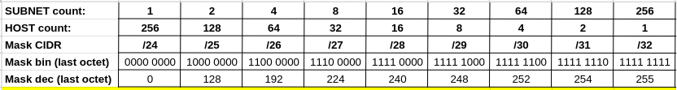

# Net_Practice

## Overview

This repository provides a foundational guide to general networking concepts, designed to support both theoretical understanding and practical application. It includes detailed notes, video references, and Python-based practice exercises that illustrate key networking scenarios and layout problems.   

Perfect for learners and professionals preparing for networking exams or looking to sharpen their IP addressing, subnetting, and configuration skills.   

---

## Features  

📘 [PDF Notes](Net-Practice_sbocanci.pdf): Concise, well-structured explanations of core networking topics   
🎥 Video Resources: Links to external video tutorials for deeper learning   
🧪 Practice Exercises: Python-based visualizations and explanations of different networking scenarios   
📊 [Subnet IP Ranges Spreadsheet](https://docs.google.com/spreadsheets/d/1CZpE01MkIXhuPhpOcWyGGSubqu9pUB6CzWMuDACY_xs/edit?pli=1&gid=1481177900#gid=1481177900): Google Sheet to help calculate and understand subnetting   
🧮 [Subnet Mask Table](image.png): Quick-reference guide for subnet mask values  

---

## Tech Stack

| Category | Technologies |
| -------- | ------------ |
| Format  | PDF, Markdown |
| Tools   | Google Sheets |

---

## File Structure

```bash
Net_Practice/
│
├── Net-Practice_sbocanci.pdf        # Main PDF notes
├── practice/
│   ├── net_practice/                # Practice exercises (to open in browser)
│   └── practice/                    # Python exercises with inline explanations
└── Subnet Mask Table.png            # Reference image
```

---

## Resources

📄 [PDF Notes](Net-Practice_sbocanci.pdf)  
🗂️ [Practice Exercises Folder](practice/net_practice/index.html) (to open in a browser)   
📊 [Subnet IP Ranges Spreadsheet](https://docs.google.com/spreadsheets/d/1CZpE01MkIXhuPhpOcWyGGSubqu9pUB6CzWMuDACY_xs/edit?pli=1&gid=1481177900#gid=1481177900)  
🧮 [Subnet Mask Table](image.png)  



---

## Lessons Learned

Working through this repository improves:   
- Understanding of networking fundamentals (IP, subnetting, routing basics)   
- Ability to break down and visualize complex network problems   
- Practical problem-solving using simplified code representations   
- Efficient use of subnet references and masks for real-world network setup   

---

## Try it out!

Once the repository is cloned, open the `practice/net_practice/index.html` file in a web browser to view / try the practice exercises.  

---

## Author

[My GitHub](https://github.com/svvoii)  
[My LinkedIn](https://www.linkedin.com/in/bocancia/)  
[My Portfolio](https://sbocanci.me/)  

---

