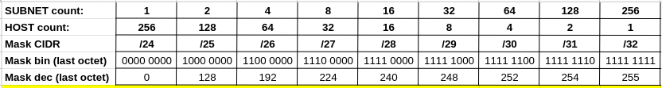

# Net_Practice

## Notes

This repository contains notes and explanations for general networking concepts, as well as links to videos with more extensive explanations of the topics.

### PDF with Notes

A PDF with notes is available in this repository. You can find it at [Net-Practice_sbocanci.pdf](Net-Practice_sbocanci.pdf).

### Practice Exercises

For a more detailed walkthrough and description of the tasks and approaches to solve them, view the `practice` folder. The practice exercises are in `.py` files for simplicity in describing the given network layouts. Look for the `description and approach` in the comments.

You can find the practice exercises at [./practice/practice/](./practice/practice/).

### Subnet IP Ranges Spreadsheet

Click the link below to access a Google Doc spreadsheet that displays the available IP ranges for any given subnet. This spreadsheet can be used as a reference when setting up network configurations or troubleshooting connectivity issues.

[Subnet IP Ranges Spreadsheet](https://docs.google.com/spreadsheets/d/1CZpE01MkIXhuPhpOcWyGGSubqu9pUB6CzWMuDACY_xs/edit?usp=sharing)

### Subnet Mask Table

This table provides a quick reference for subnet masks.

### Project Information

This project was submitted by [sbocanci](https://github.com/svvoii) on Oct 17, 2023 as a part of common core at [42 Paris](https://42.fr/en/homepage/).
